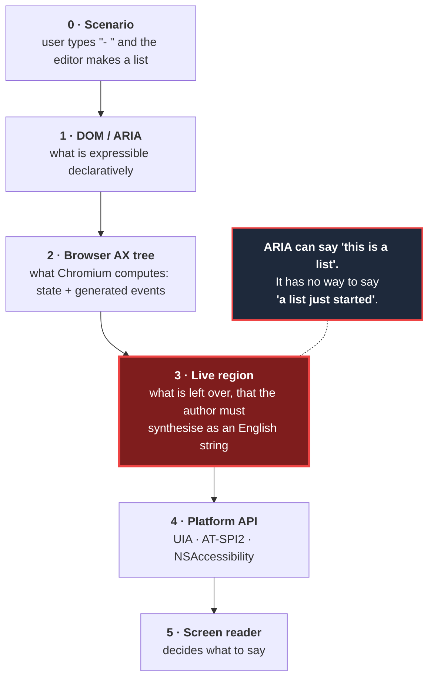

# Editing surfaces don't talk to screen readers

**We catalogued every editing operation in three HTML editors, by reading their source.
218 distinct operations. In the best of the three, 79% of what it implements says nothing
at the moment it happens.**

This repository is that work: the catalogue, the evidence, the contract, and a
conformance harness that measures an editor headless in CI without a screen reader. The
worked example — *here is what we detected, here is what we fixed, here is how* — is a
[fork of Open Notebook](https://github.com/Electro-Jam-Instruments/Open-notebook-a11y),
the first application fixed against the contract; this repository measures it the way it
would measure any editor.

Everything here is MIT licensed. It is meant to be taken and used — by any editor team,
without us.

| Directory | For the reader who wants to… |
|---|---|
| [`docs/`](docs/) | read the argument and the evidence |
| [`contract/`](contract/) | see what an editor is measured against |
| [`corpus/`](corpus/) | cite or contest a scenario |
| [`suite/`](suite/) | run the measurement against their own editor |
| [`research/`](research/) | check the provenance of a method claim |

*This is a proposed contract, not a standard. It is not endorsed by any standards body or
by any editor vendor.*

---

# Part I — It doesn't work

<!-- VIDEO: short screen capture, failure only. Transcript goes here when recorded. -->

We catalogued every editing operation in three editors — the markdown editor in Open
Notebook, Meta's **Lexical**, and **CKEditor 5** — reading their source. 218 distinct
operations. In the best of the three, **79% of what it implements says nothing at the
moment it happens**. In Lexical the editor itself announces almost nothing, and in the
standard React setup, nothing at all. These are well-built editors, by teams who care.

Silence is not the whole problem. Where these editors *do* speak, they disagree. In one,
any Enter leaves a blockquote; in another it takes two blank lines; in a third, an empty
list item. So there is nothing to learn, because what you learn in one editor is wrong in
the next. Editing should be **efficient, predictable, and clear**. Any single editor can
make itself clearer on its own. **Predictable only happens if they agree.**

The encouraging part is that every one of these editors already knows what happened. They
compute it continuously — which list you are in, your indent level, whether bold is on —
to keep their own toolbars up to date, and then do not pass it on. Live regions can carry
it today, and cheaply: one of the three already does this correctly for one container in
about twelve lines, while the blockquote's twenty-one near-identical vectors sit silent
in the same codebase. So what we want is to **unify** — for these surfaces to be
predictable and clear in the *same* way, so someone can learn it once and carry it
everywhere.

Unifying means first being able to **find** these moments — every place an editor silently
transforms your text, completes it, or moves you somewhere. We found them here by reading
source with agents, editor by editor. That catalogue goes stale the day someone ships a
feature. But the same pass can run continuously: against a codebase, or a pull request,
flagging a new auto-transform or a new suggestion menu as it lands and checking it against
the contract. That turns this from a cleanup that decays into a way of **keeping new
features working by default** — and because every live region marks something the web
platform gave authors no way to say, it also shows us precisely where the platform itself
should improve.

> ### That's the argument.
> Everything below is evidence, detail, and answers to the obvious objections. If you only
> wanted to know whether this is a real problem and whether anyone has a plan, you can stop
> here.

---

# Part II — The problem

## 1. Where the information goes

An edit happens, and what the user hears is decided across five layers. The gap is always
in the same place.



**Layer 3 is the diagnosis.** ARIA is overwhelmingly a vocabulary for **state**: this is a
list, this item is at level 2, item 3 of 7, this control is pressed. A screen reader reads
that state when the user *arrives* somewhere.

What ARIA almost entirely lacks is a vocabulary for **transition**: *you have just entered
a list; your text was just changed for you; your indent level just increased.* Live regions
exist to paper over exactly this, and they do it by degrading a semantic event into a
sentence — losing the semantics, the localisation, the user's verbosity settings, and any
chance the screen reader could present it differently on braille, suppress it, or let the
user ask about it later.

Editing is transition-dense. That is why editors are among the worst accessibility
surfaces on the web, and why the gap shows up here first and worst.

This gives the project its sharpest framing:

> **A live region is an admission of failure in the platform.** Every one in an editor is
> a marker pointing at a specific thing ARIA gave authors no way to say. Enumerate them,
> and you have enumerated what the platform is missing for editing.

## 2. Not predictable, and not clear

Two different failures, and they need different fixes.

**Not clear** is silence: you pressed Enter, the editor made you a new list item, and
nothing said so. One editor can fix this alone, today, with the live regions that already
exist.

**Not predictable** is worse, because effort does not fix it. Lexical alone ships three
mutually incompatible Enter contracts:

| Container | What Enter does |
|---|---|
| Blockquote | **any** Enter exits, dragging trailing text out with it |
| Code block | requires **two** blank lines |
| List | requires **one** empty item; nested drops a level instead of leaving |

Three containers, one editor, three rules, none of them announced. A user cannot learn
this by exploration, and what they do learn is wrong in the next editor.

> **Clarity can be fixed by one editor alone. Predictability can only be fixed together.**

That single line is why this is a shared body of work rather than three bug reports.

## 3. What we found

Three editors, read from source at pinned versions. 586 findings, converging to **218
distinct operations** as a machine-checked partition — every source finding in exactly one
canonical row, nothing double-counted.

| Editor | Operations implemented | Reaches the user |
|---|---:|---:|
| CKEditor 5 v48.4.0 | 183 | **21%** |
| Lexical v0.49.0 | 174 | **11%** |
| Open Notebook (`@uiw/react-md-editor`) | 63 | **6%** |

Denominators exclude operations an editor doesn't implement, so nobody is rewarded for
lacking features.

Two things make that table *kinder* than it looks. **The best performer is at 21%** —
CKEditor is the strongest of the three by a distance, and four in five of its editing
operations say nothing when they happen. And **some of even that is not the editor's
doing**: where a screen reader reports a list on its own because the editor emitted correct
`<ul>/<li>`, we counted it as reaching the user. Counting only *editor-originated*
announcements drops CKEditor to ~17% and Lexical to ~7%.

Measuring forced a finer vocabulary than silent-or-not. Our first harness scored
announcement as a binary, and our own evidence register retracted that as over-reporting
failure ([correction C8](docs/evidence.md)): a screen reader reads
correct semantics by itself when the user navigates back to them. Every measured cell now
lands in one of four outcomes — **announced** (told at the moment of the change, with
structure to return to), **discoverable** (nothing said, but correct semantics the screen
reader reports on navigation), **told-only** (heard once, nothing to return to), **absent**
(neither). Of the 216 cells measured so far: 4 announced, 74 discoverable, 9 told-only,
129 absent. The damning number was never "the editor said nothing" — it is that in 129 of
216 cells nothing tells the user *ever*.

The full list is a walk-through, not a spreadsheet:
**[every scenario in plain language](corpus/scenarios.md)**,
grouped by the kind of content you are working on —

| | | | |
|---|---|---|---|
| [Lists](corpus/scenarios.md#lists) · 29 | [Blockquotes](corpus/scenarios.md#blockquotes) · 17 | [Code blocks](corpus/scenarios.md#code-blocks) · 18 | [Tables](corpus/scenarios.md#tables) · 20 |
| [Text formatting](corpus/scenarios.md#text-formatting) · 13 | [Links](corpus/scenarios.md#links) · 8 | [Images and embeds](corpus/scenarios.md#images-media-and-embeds) · 8 | [Headings](corpus/scenarios.md#headings) · 3 |
| [Menus and autocomplete](corpus/scenarios.md#menus-autocomplete-and-suggestions) · 25 | [Selection, undo, paste](corpus/scenarios.md#selection-caret-undo-and-paste) · 12 | [Getting in and out](corpus/scenarios.md#getting-into-and-out-of-the-editor) · 9 | [and seven more](corpus/scenarios.md#contents) |

Each content type reads as a lifecycle — getting in, working inside, getting out — because
that is how the failures cluster. **The checkboxes are the plan.** A scenario is ticked when
a screen-reader user can complete it, and the fixes land content type by content type. Five
are ticked so far, in Open Notebook's editor — the application being fixed against this
contract — and a sixth tick was *withdrawn* when the harness measured the scenario and
judged its announcement insufficient, which is the loop working. The detect → fix → verify
write-up is
[`worked-example.md`](https://github.com/Electro-Jam-Instruments/Open-notebook-a11y/blob/claude/clone-open-notebook-hl79xs/docs/7-DEVELOPMENT/a11y/worked-example.md).

Three patterns hold across all three:

**Every editor already computes the answer, and shows it only to sighted users.**
CKEditor hooks `selection.on('change:range')` and diffs `focus.parent`. Lexical computes
`blockType` / `rootType` on every selection change and renders it as a toolbar label. Both
know the containment stack continuously. Both spend it on a visual affordance. The missing
piece is one hop to the accessibility layer — not a computation, not an architecture, one
hop.

**Every editor has announcement infrastructure wired to almost nothing.** CKEditor's
`AriaLiveAnnouncer` is well built and has **7 call sites across ~125 commands**. Lexical's
`@lexical/a11y` is well built and every announcer in it is **opt-in**, so the legacy React
API that most applications actually use gets zero. That is changing from inside: Lexical's
next release wires its heading announcer in by default through the extension API — we
measured it announcing "Heading level 1" with no opt-in — and an open PR
(facebook/lexical#9070) does the same for blockquotes, taking quote creation, exit and
destruction to `announced` when we ran its branch through the harness. Lists have no
announcer yet on any configuration we measured — exactly the extension point this work
argues for. The plumbing was never the problem; the calls are only now starting to land.

**Container boundaries are the largest and least-solved class, and the fix is proven
cheap.** Of ~170 container entry and exit vectors surveyed across CKEditor and Lexical,
**21 editor-originated announcements exist — all but one of them CKEditor's code block
(the other is its to-do list entry), one-and-a-bit containers out of nine.** Credit the
platform's own reading of correct markup as well (the canonical merge does) and CKEditor
reaches 27% of its container crossings — the ceiling correct markup alone buys. Blockquote
(21 vectors) and lists (24) sit silent in the same repository, beside working code that
would fix them.

## 4. One operation, all the way down

The simplest case in the corpus, traced through the layers. **The user types `- ` and a
space at the start of a line.**

| Layer | What happens |
|---|---|
| **0 · Scenario** | User typed two literal characters. The editor replaced them with structure. They need to know: *a list started, you are in item 1.* |
| **1 · DOM/ARIA** | In a rich editor, `<ul><li>` — correct, and the *state* is fully expressible. In our markdown textarea, **nothing**: the characters `- ` stay literal text. There is no list to report. |
| **2 · Browser AX** | Rich editor: the tree gains a list. Chromium fires structural events. Textarea: a value change, no structure. |
| **3 · Live region** | **The gap.** The *substitution event* is not expressible in ARIA at any layer above. If the user is to know a list began, an author must synthesise the sentence "bulleted list, item 1" and push it through `aria-live`. None of the three does. |
| **4 · Platform** | UIA has `TextEditChangeType_AutoCorrect`, which carries the substituted text, and `StyleId_BulletedList` in TextPattern. macOS has `NSAccessibilityAutocorrectionOccurredNotification`. **The concept exists on two platforms and is not raised by Chromium in this path — the one engine we checked.** |
| **5 · Screen reader** | Says nothing at the moment. In the rich editor the list is discoverable if the user later navigates into it; in the textarea there is nothing to find. Either way, the user types on believing they typed a hyphen. |

We ran this for real, headless, on Chromium 141. The suite now measures **8 contracts —
24 operations — against 9 subjects: 900 assertions, 291 passes, 346 MUST failures**,
summarised as 216 outcome cells — 4 announced, 74 discoverable, 9 told-only, 129 absent
([`suite/examples/report-2026-08.json`](suite/examples/report-2026-08.json) holds every cell). Here is
the simplest operation in full, on the four original subjects — 36 assertions, 17 pass,
8 MUST failures:

| | contenteditable | our textarea | our textarea **+ fix** | real `@uiw` build |
|---|---|---|---|---|
| `create.structure` (MUST) | FAIL | ~PASS | ~PASS | ~PASS |
| `create.announcement` (MUST) | FAIL | FAIL | **PASS** | FAIL |

The third column is the point: the same structural substrate, one announcement added,
contract satisfied. Satisfied — and then caught by its own suite: the same subject fails
the entry-parity contract (it announces list creation when you type `- `, and is silent
when the caret arrives in the same list by arrow — the C-3 violation our own corpus calls
worse than silence), and because a textarea has no structure to return to, the cell scores
`told-only`, not `announced`, in the outcome model. The suite polices our fixes as hard as
everyone else's. And it is not simply always-red — the bare `contenteditable` control and
the fixed subject produce different, expected results.

---

# Part III — How AI can help

This is the part worth your time, because it is the part that is new.

## Why this problem in particular

Most accessibility work resists automation. This one does not, and it is worth saying why
explicitly rather than making a general claim about tooling:

- **It is enumerable.** Every one of these failures is a specific place in source where an
  editor transforms text, completes it, or moves the caret. You can find them by reading
  the code.
- **It is patterned.** Around twenty invariants cover hundreds of cases. The fix has the
  same shape every time.
- **It is verifiable without a screen reader.** The check runs headless, on Linux, in CI,
  and is deterministic.
- **It recurs.** Editors ship features constantly, and each new autoformat rule or
  suggestion menu is a fresh silent failure. A one-time audit decays immediately.

That last property is what makes this worth automating rather than doing once.

## Detection: what the pass found

We pointed agents at three editors' source and asked them to enumerate every operation
that changes the document, moves the caret, or opens a menu — then to record what, if
anything, reaches a screen-reader user. That produced the 586 findings and the table in
Part II.

**This took a day.** Not because the analysis is shallow, but because it is mechanical:
read the command set, read the keyboard handlers, read what the editor does and does not
tell the accessibility layer.

## Fixing: the shape is the same every time

The reason detection is useful is that the fix generalises. Take the hardest class —
container boundaries, the largest group in the corpus.

A container like a blockquote has **sixteen ways in and out**: autoformat, toolbar command,
arrow in from above, arrow in from below, backspace merging you in, paste, undo, and the
symmetric exits. Implemented one by one, that is sixteen fixes per container, times nine
container types.

Nobody should write that. And nobody has to, because **the fix does not care how you got
there**:

```
on selection change:
    stack = containmentStackAtCaret()      // [document, blockquote, list, listItem]
    if stack ≠ previousStack:
        announce(whatChanged(previousStack, stack))
    previousStack = stack
```

Diff the containment stack instead of hooking each vector, and every entry and exit vector
is covered at once — arrow-in, arrow-out, backspace-merge, autoformat, undo, paste.
Sixteen vectors, one implementation. Nine container types, the same code.

**This is not hypothetical.** CKEditor already does exactly this for code blocks — it hooks
`selection.on('change:range')`, compares `focus.parent`, and announces the result. It is
about twelve lines, and it correctly covers every entry and exit vector we traced in its
source — CKEditor has not yet been run through the harness. (One measured caveat from the
same construct: the announced language name is unreachable afterwards — it lives in a CSS
class with no accessible name — so even the corpus's best announcement scores `told-only`
on its language.) Blockquote and lists, in the same repository, do none of it: twenty-one
and twenty-four silent vectors respectively, sitting beside working code that would fix
them.

## Putting the two together

Detection tells you *where*; the invariants tell you *what good looks like*; the fix shape
tells you *how*, once, for a whole class. That combination is what makes it runnable
continuously rather than as a one-off audit:

1. **Point it at a codebase** → the catalogue in Part II.
2. **Point it at a pull request** → "this change adds a new auto-transform. It is silent.
   Here is the invariant it fails and the shape of the fix."
3. **Point it at a build** → the conformance suite scores the editor headless, in CI, with
   no screen reader, and fails the build on a regression.

The claim we want to make is not *"AI can fix accessibility"*. It is narrower and more
defensible: **for this particular class of problem — enumerable, patterned,
machine-verifiable, and constantly regenerated by new features — the work of finding and
checking can now be continuous, and that changes it from an audit that decays into
something that holds.**

---

# Part IV — Where the platform must change

Unification reveals the gaps. Once you write down what every editor *should* announce, the
entries that can only be satisfied by synthesising an English string are, by construction,
the places the web platform gave authors no way to say something.

The headline finding is sharper than we expected:

> **On the one platform whose notification API is typed — Windows UIA — Core-AAM
> instructs every user agent to hardcode the type to "action completed", and Chromium
> and Gecko both comply.**

Core-AAM writes `NotificationKind_ActionCompleted` in as a literal constant; the other
platforms' channels carry politeness or priority only, so there is no type to lose off
Windows. **The typing channel exists, is plumbed end to end, and is deliberately not
used.** That reframes the ask: this is not "invent a way to type announcements", it is
"stop throwing away the type on the platform that already has a field for it."

Three proposals, ranked by cost:

**1 · A `kind` enum on `ariaNotify` — cheapest, do this first.** Even just
`{completed, aborted, itemAdded, itemRemoved, other}`, deliberately isomorphic to UIA.
Costs one IDL enum and one line in Core-AAM replacing a hardcoded constant with a mapped
variable; other platforms ignore it, which is exactly the status quo, not a regression.
Immediate win: **"operation failed" is currently unreachable from the web**, because the
spec hardcodes `ActionCompleted`.

**2 · Level and structure transitions — the browser-side work is already done.** Chromium
computes `HIERARCHICAL_LEVEL_CHANGED` cross-platform and discards it on two platforms. The
ask is to give those two platforms somewhere to put what the third already receives.

**3 · A text-substitution signal — most valuable, hardest.** A two-platform floor already
exists and the UIA variant carries the substituted text. Three obstacles: both APIs are
documented as scoped to *user-agent* correction, so repurposing them for author-initiated
transformation needs Microsoft and Apple to bless it; `UIA_TextEdit_TextChangedEventId` has
**zero known screen-reader consumers**, so shipping it means shipping into a void; and an
author-facing API must name the substituted *range*, which drags in `EditContext`.

There is also a real possibility that **containment needs no new event at all**. UIA's
TextPattern already models blockquote, bulleted list and numbered list as text attributes
(`StyleId_Quote`, `StyleId_BulletedList`, `StyleId_NumberedList`). Whether Chromium
actually maps HTML onto them on Windows is **unverified** — it needs a UIA inspector on a
Windows box, and it is on the list.

---

# Part V — What we are not claiming

Stated plainly, because the limits matter as much as the findings. The full register is in
[`EVIDENCE.md`](docs/evidence.md).

1. **Browser-told, not user-heard.** Everything we measured observes what Chromium was
   told, or what the Linux accessibility bridge carried. It does not observe what NVDA,
   JAWS or VoiceOver *said*. A passing contract predicts a good experience; it does not
   prove one.
2. **No screen reader has been validated against.** Every task requiring one is marked
   `awaiting-human`, never `done`.
3. **No user testing.** Nothing here substitutes for blind users using these editors.
4. **The percentages are source-read, not measured.** They are our best reading of three
   codebases at pinned versions. Our own editor and three Lexical builds (stock 0.49.0,
   and the 0.49.1-nightly extension API with default and maximal announcers) have been
   put through the harness — and the Lexical runs confirmed the source reading's central
   prediction: correct structure, zero announcement. CKEditor has not been measured;
   that is the next job, and it is the fair thing to attack.
5. **`discoverable` is a bounded claim.** It means correct semantics that an AT reports
   by default on navigation. The full chain — Chromium role, Core-AAM mapping, NVDA
   source, default on — is verified end-to-end for blockquote only; the other constructs
   rest on Chromium-measured roles plus NVDA defaults read from source, not yet verified
   per construct. And on an editing surface NVDA deliberately reports less: an editable
   list keeps its bare entry announcement but loses its item count and its line-exit
   announcement (measured on the Linux bridge, confirmed in NVDA source) — so
   `discoverable` while editing is weaker than while reading. That demotion is itself
   part of the case for editor announcements.
6. **The corpus omits the two most-deployed editor families — one is now inventoried
   *and* measured.** ProseMirror/Tiptap (~19M weekly npm downloads) is read
   ([`scenarios/tiptap.md`](corpus/inventories/tiptap.md), 123 rows) and
   run through the harness — the source reading's headline held exactly: **zero
   announcements and zero live regions across all 24 operations**, with the broadest
   correct structure of any subject (19 of 24 `discoverable`). It is not yet merged into
   the canonical 218, so "three editors" for that corpus means exactly that; Quill (8M
   weekly downloads, dormant since 2024-11) is neither inventoried nor measured.
7. **We do not claim agents can write these fixes unsupervised.** The claim is that
   *finding* and *checking* can be continuous. The fixing is still engineering.
8. **The Windows and macOS platform mappings are documentation-level**, except where
   explicitly marked measured — and none of the Windows claims are measured.

---

# Part VI — Questions you are probably already asking

**Doesn't axe already do this?**
No, and not by oversight. axe checks *static* conformance — is this element labelled, does
this contrast pass, is this role valid. Every failure in this corpus is a **transition**:
the markup is often perfectly correct both before and after, and the defect is that nobody
was told it changed. There is no static snapshot in which it is visible.

**Isn't ARIA-AT the answer?**
ARIA-AT is the right idea and the direct precedent, and it drives *real* screen readers
against APG widgets, which is strictly more truthful than what we do. Two gaps: it does not
cover editing surfaces, and because it needs a real screen reader on a real OS it cannot
run headless in CI on Linux. This is the editor-shaped counterpart that trades some truth
for the ability to run on every pull request. They are complementary; ours is the cheap
gate, theirs is the ground truth.

**Why not just test with a real screen reader?**
You should, and we say so — it is the ground truth, and it is the one thing we have not yet
done under controlled conditions (one informal NVDA session is on record, and it is what
our two platform measurements were chasing). But it does not scale to a per-commit gate,
it is not deterministic, and it cannot tell you *which layer* failed. Observing at the
browser can: it distinguishes "the editor
never said anything" from "the editor said it and the bridge dropped it", which is exactly
the distinction you need to know whether to file a bug against an editor or a browser.

**Isn't this just the editor's problem to fix?**
Half of it. Clarity is the editor's problem and they can fix it today. Predictability is
not — no single editor can make itself consistent with the others, and the reason they all
diverge is that nothing tells anyone what the target is. That part needs a shared contract,
and some of it needs the platform.

**Our editor passes accessibility audits. Is it in this 79%?**
Almost certainly, and passing is not evidence otherwise — see the axe answer. The quick
test takes a minute: turn on a screen reader, type `- ` and a space, then `> `, then press
Enter on an empty list item. If it says nothing at each step, you are in the 79%.

**You forked Open Notebook and it scored worst. Is that fair?**
It is ours, so it is the one we get to fix rather than merely criticise. It also scores
worst for an instructive reason: it is a plain markdown `<textarea>`, so its failures are
disproportionately **structural** — 46 of 63 implemented operations produce no structure at
all, rather than correct structure that goes unannounced. That is the worse class, because
there is nothing to announce *about*, and no announcement can repair it.

**Is any of this tainted by CKEditor's GPL?**
No. We read CKEditor's source and quote small excerpts as analysis; we do not vendor,
link, or redistribute it. The harness points at builds you supply yourself. Our code is
MIT, standalone.

---

# The work itself

**Start here**
| | |
|---|---|
| [**`corpus/scenarios.md`**](corpus/scenarios.md) | **The walk-through.** All 218 scenarios in plain language, grouped by content type, with what each editor does today. Start here if you want to talk through the problem rather than argue about it. |
| [**`docs/lexical-programme.md`**](docs/lexical-programme.md) | **The method in motion.** The plan, the agents, the analysis, and the execution against a real editor — with the strategic choices stated as choices. |
| [**`docs/method.md`**](docs/method.md) | **The system.** The six reusable parts, the editor roster with licences and activity, what GPL actually restricts, and the order of work. The per-editor fixes are demonstrations; this is the product. |
| [**`docs/findings.md`**](docs/findings.md) | **The engineering deep-dive.** What is and is not working, editor by editor, with the generated 24×9 outcome matrix, the platform-rescue verdicts, and the instrument's own limits. |
| [`docs/evidence.md`](docs/evidence.md) | Every claim above, with provenance: measured / source-read / documented / inferred, plus the corrections and the limits |
| [`docs/synthesis.md`](docs/synthesis.md) | The seven cross-editor patterns, and the priority order |
| [`corpus/canonical.md`](corpus/canonical.md) | The 218 canonical operations, one column per editor |

**The corpus** — [`corpus/`](corpus/): per-editor inventories
for [Open Notebook](corpus/inventories/open-notebook.md) (83),
[Lexical](corpus/inventories/lexical.md) (201) and
[CKEditor 5](corpus/inventories/ckeditor5.md) (302), all read from source
and merged into the canonical 218; plus
[Tiptap/StarterKit](corpus/inventories/tiptap.md) (123 rows, read
2026-08-30 and measured the same day — prediction held; not yet merged into the
canonical set).

**The specification**
| | |
|---|---|
| [`contract/rationale.md`](contract/rationale.md) | What an editing surface must announce, as ordered clauses |
| [`contract/containment.md`](contract/containment.md) | The eight entry and eight exit vectors, and why the fix is vector-agnostic |
| [`contract/invariants.md`](contract/invariants.md) | How the matrix reduces to ~20 invariants plus data plus adapters |

**The measurement**
| | |
|---|---|
| [`suite/`](suite) | Runnable CDP harness — subjects, contracts, results |
| [`docs/observing-chromium.md`](docs/observing-chromium.md) | Observing accessibility behaviour from Chromium without a screen reader |
| [`research/atspi/FINDINGS.md`](research/atspi/FINDINGS.md) | AT-SPI2 captured headless with no X server at all |
| [`docs/platform-apis.md`](docs/platform-apis.md) | UIA / AT-SPI2 / NSAccessibility, and the three ranked proposals |

**The worked example** — fixing a real application against the contract, in its own
repository:
[Open-notebook-a11y](https://github.com/Electro-Jam-Instruments/Open-notebook-a11y) —
its editor is measured here as the `uiw-react-md-editor` → `open-notebook-fixed`
before/after pair.

## Reproducing the measurements

```bash
cd suite
node subjects/lexical/build.mjs         # build the Lexical subjects from their recipes —
node subjects/lexical-next/build.mjs    # exact pins, built on your machine; nothing
node subjects/tiptap/build.mjs          # third-party ships in this repo, and run.mjs
                                        # names any subject it skips as unbuilt
node run.mjs                            # the comparison table, all subjects
node run.mjs --check --subject=tiptap   # gate one subject; exit 1 on any regression

cd ../research/atspi && ./setup.sh && ./run-headless-nox.sh   # AT-SPI2 capture, no X server
```

**The loop, not the table, is the deliverable.** A contract clause declares which canonical
scenarios it measures; `run.mjs` writes a per-scenario verdict and a per-operation outcome
— `announced` / `discoverable` / `told-only` / `absent` — into `results.json`; the
walk-through's ticks are *generated* from that file rather than typed; and `--check` gates
a committed baseline so a fix, once made, cannot silently come undone. A scenario reads
`✅ measured` only when it passed in a real browser — and the tick is a claim the suite can
take back, as it already has once. Scenarios fixed in the app but not yet
covered by a clause read `🔧 fixed`, which is a weaker and more honest claim.

## Contributing

The most useful contributions, in order: **an adapter for an editor we haven't measured**;
**a challenge to a canonical scenario** (say which of the 218 rows is wrong and why); **a
term for the announcement vocabulary**; and **a measured result that contradicts one of our
source-read predictions** — that last one is the most valuable thing you could send us.

## Licence and attribution

Our work — the docs, the corpus, the contract, the suite, the recipes and the hand-written
subject pages — is **MIT** ([`LICENSE`](LICENSE)).

**Nothing third-party is redistributed here.** CKEditor 5 is GPL-or-commercial, Lexical
and `@uiw/react-md-editor` are MIT, Tiptap is MIT; all are read as source and quoted as
analysis, as are Chromium, NVDA and WebKit. Real editors are measured from builds made
**on your machine** by the recipes in `suite/subjects/` — the repository distributes the
recipe; your machine holds the copy. This is about distribution, not testing: running the
suite against any editor locally is use, and licence obligations attach to conveying
copies, which the suite is designed never to do.

That posture was learned the hard way, and it should be named plainly: an earlier
iteration of this work (in [the fork](https://github.com/Electro-Jam-Instruments/Open-notebook-a11y)
where it was developed) shipped a ~680 KB built bundle of `@uiw/react-md-editor` and
roughly a hundred transitive dependencies. Everything in it was permissive (MIT, plus one
ISC), so redistribution was permitted — but permitted is not the same as properly
attributed, and its notices were inadequate: no MIT permission text and no per-package
copyright lines. The artefact was removed and replaced by the recipe pattern this
repository ships. The full roster of what was read and quoted, and under what posture, is
[`ATTRIBUTION.md`](ATTRIBUTION.md).

The worked example measures **[Open Notebook](https://github.com/lfnovo/open-notebook)**
by Luis Novo (MIT), via
[our fork](https://github.com/Electro-Jam-Instruments/Open-notebook-a11y); its upstream
copyright stands in that repository's `LICENSE`.
