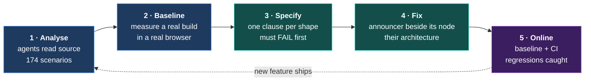

# The shape of the work — Lexical

**Companion to the [README](../README.md).** The README argues the problem. This
argues *the method, in motion*: here is the plan, here are the agents, here is the initial
analysis, here is us executing it, here is it running continuously. It is the second
document, and it is deliberately about **shape and choices** rather than task detail —
that lives in [LEXICAL-PLAN.md](lexical-plan.md).

---

## The arc

The loop back is the point. A one-time audit decays the day someone ships a feature; this
returns to step 1 on every change.

## Where we actually are

Honest status, not aspiration.

| Stage | State | Evidence |
|---|---|---|
| **1 · Analyse** | done for v0.49.0 | [scenarios/lexical.md](../corpus/inventories/lexical.md) — 174 scenarios, read from source |
| **2 · Baseline** | done, two subjects | `lexical-stock` (0.49.0 React plugins) · `lexical-next` (nightly, extension API) |
| **3 · Specify** | **2 of 9 shapes** | `bulleted-list`, `heading` |
| **4 · Fix** | **0 of 9** | nothing implemented by us yet |
| **5 · Online** | not started | no CI, no baseline for these subjects |

**The system is proven; the coverage is thin.** One clause has gone all the way round the
loop against somebody else's code, and it produced a real result:
`# ` announces `[polite] "Heading level 1"` on the extension API and **nothing at all** on
the stock React path.

## The agents

Five passes. Each is a versioned prompt, not a person and not a service — that is what
makes this portable to a team that has never spoken to us.

| Agent | Does | Model | Runs |
|---|---|---|---|
| **Detector** | Reads a package's source; enumerates every operation that transforms, completes or moves | Opus | once per package, again per release |
| **Merger** | Collapses findings onto canonical scenarios by user intent | Opus | after each detector run |
| **Clause author** | Turns a scenario into a contract clause; **must watch it fail** | Opus | once per shape |
| **Implementer** | Writes the announcer following the editor's own conventions | Opus | once per shape |
| **Reviewer** | Adversarial read: would this pass for the wrong reason? | Opus | before every upstream PR |

Sonnet handles the mechanical residue — locale fan-out, link fixes, regenerating derived
files. Nothing that ends in a claim about assistive technology runs on it, because the
failure mode is not a broken build but a *plausible* announcement that does not match what
the browser does.

## What we found before writing any code

- **174 scenarios; 4 announcers.** Heading, auto-link, history, editor-mode.
- **No list announcer exists.** Lists are the highest-volume structure in real documents.
- **The architecture is already decided, and it is the right one.** `"Announcers live with
  their node." "Accessibility is the default."` `RichTextExtension` pulls the heading
  announcer in automatically; an integrator opts *out*, not in.
- **Two Lexicals.** The stock React path most teams ship gets none of this; the extension
  API gets it free. That gap is the finding Lexical cannot easily see from inside.

## The state of the relationship

This is not a cold audit. There is already a working relationship, which changes the
strategy completely.

| PR | Shape | State |
|---|---|---|
| [#8908](https://github.com/facebook/lexical/pull/8908) | `# ` → heading | **merged** 2026-08-13 |
| [#9071](https://github.com/facebook/lexical/pull/9071) | URL → link | **merged** 2026-08-21 |
| [#9070](https://github.com/facebook/lexical/pull/9070) | `> ` → quote | **open** — blocked only on `pnpm run lint:fix` |
| [#8929](https://github.com/facebook/lexical/pull/8929) | typeahead menus | **open** — architectural question on table/menu coupling |

Two merged, two open, one of them blocked on a lint rule that changed underneath it.

---

## The strategic choices

Four, each a real fork with a recommendation rather than a menu.

### A · Where to enter

| Option | Case for | Case against |
|---|---|---|
| **Unblock #9070** | One command. Converts an open PR into a third merged shape and a third announcer. | Not our system doing anything — it is housekeeping. |
| **Lists (S5)** ← *recommended* | Largest gap, no announcer, exact template next door in `HeadingAnnounceExtension`. Highest value per hour. | A new PR into a queue that already holds two of ours. |
| **Clause for the open #9070** | Failing on `main`, passing on the branch — review evidence maintainers do not have. Shows the system helping a PR rather than filing one. | Helps one PR; does not extend coverage. |

**Recommendation: all three, in that order.** They are hours apart, not days, and together
they tell the whole story — we unblocked one, evidenced another, and found and filled the
biggest hole.

### B · Breadth or depth

Take **one shape through every vector** (create, enter, exit, undo, paste — the C-3/C-4
invariants) before starting the next.

Depth first, because the interesting failures are in the vectors nobody hooks. An editor
that announces autoformat entry but not arrow entry passes a shallow suite and fails a real
user. Lists done properly will also *generate* most of the containment invariants the other
shapes then reuse — which is the "editor N+1 costs less" test working.

### C · How much to upstream

**Measure everything, upstream selectively.** Findings are cheap to produce and expensive
to review, and the reviewer is a person with a queue.

Two of our PRs are already open. **Land those before opening more.** A maintainer who sees
four simultaneous agent-assisted PRs learns something about us that we do not want them to
learn. The measurement is valuable to them as *evidence attached to work already in
flight*, long before it is valuable as new work.

### D · Whether to say agents wrote it

**Yes, plainly, in every PR.** Nothing to gain by hiding it and everything to lose when it
surfaces — and the whole point of this project is that agents can do this work well. A PR
that says *"written with agent assistance; here is the contract it was measured against and
the command that reproduces it"* is more trustworthy than one that quietly omits it, not
less.

---

## What "online" means

The end state, and the only one that does not decay:

1. The suite runs in CI against pinned `lexical-stock` and `lexical-next` builds.
2. A baseline is committed. A regression fails the build and names the assertion.
3. A nightly bump that silently drops an announcement is caught **the day it lands**,
   not at the next audit.
4. The detector re-runs per release, so a new autoformat rule appears as an unmeasured
   scenario rather than a silent one.

At that point the claim stops being *"we fixed some things"* and becomes **"new features
work by default, and we can prove it continuously."** That is the sentence the whole
project exists to be able to say.

## What would make this fail

Written down now, while it is cheap to admit.

- **Clause quality.** A clause that passes for the wrong reason is worse than none — it
  manufactures false confidence at scale. Hence the must-fail-first rule and the reviewer.
- **Maintainer bandwidth.** We do not control the merge queue, and flooding it converts a
  good relationship into a bad one.
- **Nightly drift.** Pinning is not optional; an unpinned nightly makes every number
  irreproducible.
- **Browser-told, not user-heard.** Still true, still the honest limit. None of this is a
  substitute for a screen reader and a person, and no volume of green cells changes that.
